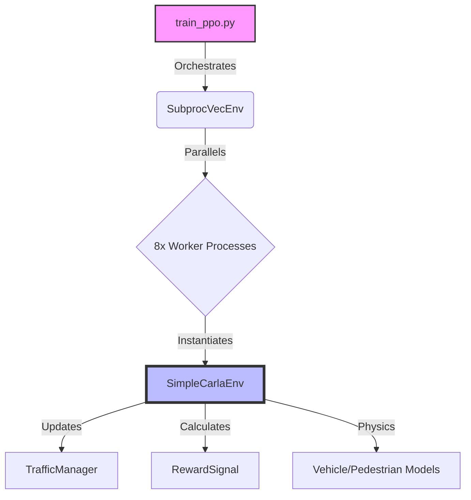

# SimpleCarla Reinforcement Learning Environment

**SimpleCarla** is a lightweight, 2D traffic simulator built on Pygame and Gymnasium, designed for rapid Reinforcement Learning (RL) research. It uses CARLA OpenDRIVE (`.xodr`) maps to provide realistic road networks while maintaining extremely high training throughput (>400 FPS) on CPU.

---

## 🏗️ Architecture

The project follows a standard Gymnasium structure, wrapped for parallel training with Stable Baselines 3 (SB3).



### Key Components

| Component | File | Description |
|-----------|------|-------------|
| **Core Env** | `SimpleCarla/simple_carla_env.py` | The main Gym environment. Handles the Pygame loop, map parsing, sensor simulation (Raycast Lidar), and checking terminal conditions (Collision, Off-road). |
| **Traffic** | `SimpleCarla/traffic_manager.py` | The "Brain" of the simulation. Manages NPC vehicles (IDM physics, lane changing) and Pedestrians (avoidance logic). |
| **Rewards** | `SimpleCarla/rewards.py` | Defines the learning signal. Includes logic for Progress (Alignment * Speed), Safety (Collisions), and Smoothness (Steering Stability). |
| **Wrappers** | `SimpleCarla/wrappers.py` | Gymnasium wrappers that normalize observations (Lidar 0-1, State -1 to 1) to make training stable for Neural Networks. |
| **Training** | `SimpleCarla/train_ppo.py` | The entry point. Configures PPO, parallel environments, and the **Hybrid Recording System**. |

---

## 🛠️ Data Flow & Wrappers

### 1. The Observation Wrapper (`wrappers.py`)
Raw sensor data from the simulator is complex. The `CarlaObservationWrapper` transforms it into a clean tensor for the AI:
*   **Lidar**: Normalized from [0, 50m] to [0, 1].
*   **State**: Includes Speed, Steering, Lateral Error, Heading Error, and Traffic Light state. All normalized to [-1, 1].
*   **Vector Only**: To speed up training, we removed image processing (CNNs) and rely purely on these vector sensors (`MlpPolicy`).

### 2. The SingleCoreRenderWrapper (`train_ppo.py`)
**Problem**: Saving video from 8 parallel environments usually creates a massive 3x3 grid video, most of which is redundant or slows down the system.
**Solution**: We implemented a custom `SingleCoreRenderWrapper`.
*   **Core 0**: Initialized with `render_mode="rgb_array"`. It draws the frames for video.
*   **Cores 1-7**: Initialized with `render_mode=None`. They run in "Headless Turbo Mode", skipping all drawing code.
*   **Result**: The video recorder only captures the view from Core 0, resulting in a clean, single-screen video and maximum training FPS.

---

## 🚀 Usage

### 1. Train the Agent
Start the PPO training pipeline. This will launch 8 parallel workers and train for 10 Million steps (or until convergence).

```bash
venv/bin/python SimpleCarla/train_ppo.py
```

*   **Outputs**:
    *   Tensorboard logs: `SimpleCarla-logs/<timestamp>/tensorboard`
    *   Models: `SimpleCarla-logs/<timestamp>/models`
    *   Videos: `SimpleCarla-logs/<timestamp>/videos` (Saved every ~100 eps)
*   **Stopping**: The training stops automatically if the agent achieves a mean reward > 500 over 40 consecutive episodes (Robust Convergence).

### 2. Visualize Results
To see the *latest* trained model in action (Real-time, Human View):

```bash
venv/bin/python visualize.py
```

This script automatically finds the most recent log directory, loads the model, and plays a live demo.

### 3. Manual Mode / Debugging
To drive the car yourself or test the environment physics without AI:

```bash
venv/bin/python SimpleCarla/run_env.py -map Town01 --traffic mid
```
*   **Controls**: Arrow Keys to drive.

---

## 🧠 Logic Details

### Traffic Manager
The `TrafficManager` ensures the world is dynamic but safe.
*   **Vehicles**: Use Intelligent Driver Model (IDM) to follow lead cars and stop for red lights. They yield to the Ego vehicle if it is actively in front.
*   **Pedestrians**: Spawn on sidewalks and cross at junctions. They have a "Safety Bubble" (4.0m) implementation—if a car enters this bubble while they are crossing, they freeze to avoid suicide.

### Reward Function
The agent optimizes for:
1.  **Speed**: But only when aligned with the road (`speed * cos(heading_error)`). This prevents "Donuts".
2.  **Safety**: -100 penalty for collisions or driving wrong-way.
3.  **Comfort**: Penalty for rapid steering changes at high speeds.

---
*Created for Master Thesis - Advanced Agentic Coding*
